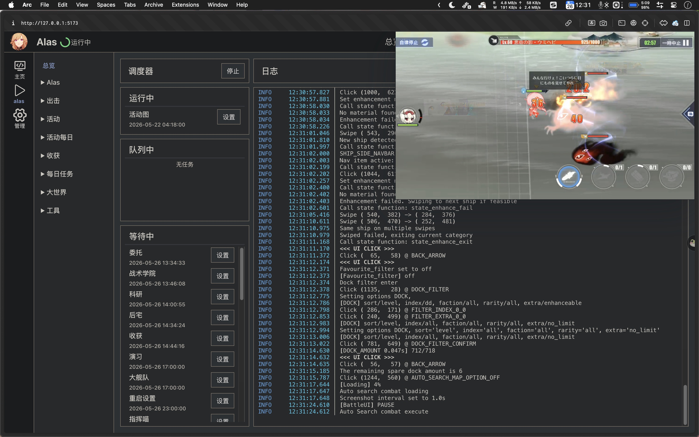

# 手游挂机小助手

[English](#english) | [日本語](#日本語)



闲着无聊拿 Codex 搓的小工具。它可以把挂机脚本和手机画面放进同一个网页里

是时候把脚本和模拟器放进同事的神秘win nas了，解放主力机内存资源

## 架构

- `src/`：前端页面、悬浮手机画面、交互逻辑
- `server/bridge.js`：把浏览器 WebSocket 转发到设备的 ADB TCP 端口

## 目录

- `config/`：bridge 和示例配置
- `resources/`：前端公开资源和本地 `scrcpy-server.jar`
- `scripts/`：调试探针脚本
- `server/`：bridge 和生产静态服务
- `src/`：前端源码
- `run.sh`：Linux 启动脚本

## 配置

- `config/default.json`

前端页面、bridge、开发端口和正式静态服务都读取这一份配置。

配置项：

- `pageUrl`：挂机脚本网页地址
- `bridgeUrl`：前端连接的 WebSocket bridge 地址
- `deviceSerial`：ADB 地址，例如 `your-adb-host:16384`
- `scrcpyServerPath`：项目内本地 `jar` 文件相对路径
- `appPort`：前端页面端口，开发模式和正式静态服务共用
- `bridgePort`：bridge 监听端口

项目使用本地 scrcpy server 文件：

- `resources/scrcpy-server.jar`

如果你想重新下载或升级版本：

```bash
npm run prepare:scrcpy-server
```

## 启动

```bash
npm install
chmod +x run.sh
./run.sh
```

安装依赖：

```bash
npm install
```

开发模式：

```bash
npm run bridge
npm run dev
```

前端默认监听 `0.0.0.0`。

构建前端：

```bash
npm run build
```

运行正式环境：

```bash
npm run bridge
npm run preview:prod
```

可用环境变量：

- `APP_HOST`：默认 `0.0.0.0`
- `APP_PORT`：默认读取 `config/default.json` 的 `appPort`
- `BRIDGE_PORT`：默认读取 `config/default.json` 的 `bridgePort`

## 说明

- 如果目标网页禁止 iframe 嵌入，页面内将无法显示。
- 浏览器版 scrcpy 底层仍然基于 ADB 协议，但用户不需要手动运行 `adb`。
- 如果浏览器环境不支持 `WebCodecs`，前端会自动回退到 `TinyH264` 软件解码。

---

## English

[中文](#手游挂机小助手) | [日本語](#日本語)

This is a small tool built with Codex. It puts the idle script and the phone screen into the same web page, so you can host the emulator and automation environment on another machine and still view and control it remotely.

## Architecture

- `src/`: frontend page, floating phone screen, interaction logic
- `server/bridge.js`: forwards browser WebSocket traffic to the device's ADB TCP port

## Directory Layout

- `config/`: bridge and example configuration
- `resources/`: public frontend resources and local `scrcpy-server.jar`
- `scripts/`: debug probe scripts
- `server/`: bridge and production static server
- `src/`: frontend source code
- `run.sh`: Linux startup script

## Configuration

- `config/default.json`

The frontend page, bridge, dev port, and production static server all read from this single config file.

Main fields:

- `pageUrl`: idle script page URL
- `bridgeUrl`
- `deviceSerial`
- `scrcpyServerPath`: relative local jar path inside this project
- `appPort`: frontend page port for both dev mode and production static server
- `bridgePort`

The project uses a local scrcpy server file:

- `resources/scrcpy-server.jar`

To redownload or upgrade it:

```bash
npm run prepare:scrcpy-server
```

## Start

```bash
npm install
chmod +x run.sh
./run.sh
```

Install dependencies:

```bash
npm install
```

Development mode:

```bash
npm run bridge
npm run dev
```

The frontend listens on `0.0.0.0` by default.

Build the frontend:

```bash
npm run build
```

Run the production environment:

```bash
npm run bridge
npm run preview:prod
```

Supported environment variables:

- `APP_HOST`: defaults to `0.0.0.0`
- `APP_PORT`: defaults to `appPort` from `config/default.json`
- `BRIDGE_PORT`: defaults to `bridgePort` from `config/default.json`

## Notes

- If the target page forbids iframe embedding, it cannot be displayed inside the page.
- Browser-based scrcpy still uses the ADB protocol internally, but users do not need to run `adb` manually.
- If `WebCodecs` is unavailable in the browser environment, the frontend automatically falls back to `TinyH264` software decoding.

---

## 日本語

[中文](#手游挂机小助手) | [English](#english)

これは Codex で作った小さな道具です。放置脚本と手機画面を同一の Web 頁面にまとめ、別の機械で動いている模擬器と自動化環境を、閲覧器から確認・操作できるようにしています。

## 構成

- `src/`: 前端画面、浮動手機画面、操作処理
- `server/bridge.js`: 閲覧器の WebSocket を端末の ADB TCP 端口へ転送

## 目録構成

- `config/`: bridge と設定例
- `resources/`: 前端公開資源と本地 `scrcpy-server.jar`
- `scripts/`: 調試用探針脚本
- `server/`: bridge と本番用静的服務
- `src/`: 前端源碼
- `run.sh`: Linux 起動脚本

## 設定

- `config/default.json`

前端頁面、bridge、開発端口、本番静的服務はすべてこの一つの設定文件を読みます。

主な設定項目:

- `pageUrl`: 放置脚本頁面 URL
- `bridgeUrl`
- `deviceSerial`
- `scrcpyServerPath`: 項目内 jar 相対経路
- `appPort`: 前端頁面端口。開発模式と本番静的服務で共用
- `bridgePort`

この項目は本地の scrcpy server 文件を用います。

- `resources/scrcpy-server.jar`

再取得や更新を行う場合:

```bash
npm run prepare:scrcpy-server
```

## 起動

```bash
npm install
chmod +x run.sh
./run.sh
```

依存関係を導入:

```bash
npm install
```

開発模式:

```bash
npm run bridge
npm run dev
```

前端は既定で `0.0.0.0` を監聴します。

前端を構築:

```bash
npm run build
```

本番環境を実行:

```bash
npm run bridge
npm run preview:prod
```

利用可能な環境変数:

- `APP_HOST`: 既定値は `0.0.0.0`
- `APP_PORT`: 既定では `config/default.json` の `appPort` を使用
- `BRIDGE_PORT`: 既定では `config/default.json` の `bridgePort` を使用

## 注意

- 対象頁面が iframe 埋込を禁止している場合、頁面内表示はできません。
- 閲覧器版 scrcpy も内部では ADB 協議を使いますが、利用者が `adb` を手動実行する必要はありません。
- 閲覧器環境で `WebCodecs` を利用できない場合、前端は自動的に `TinyH264` 軟件解碼へ切り替わります。
